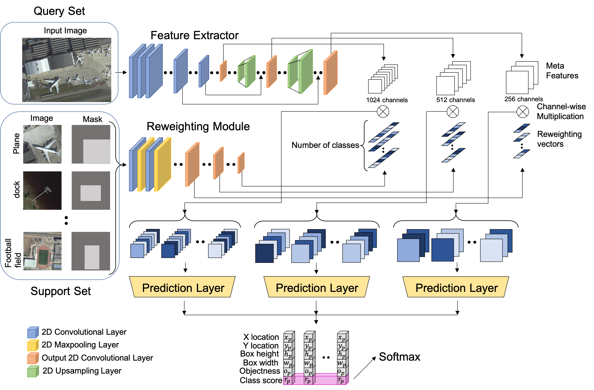

This is the source code for our paper <b></b>.


# Few-shot Object Detection on Remote Sensing Images


Introduction
------------
This is the source code for our paper **Few-shot Object Detection on Remote Sensing Images**

Paper link: https://arxiv.org/abs/2006.07826

Network Architecture
--------------------
The architecture of our proposed model is as follows



Results on NWPU and DIOR dataset
--------------------


## Installation
Please see [YOLO-Low-Shot](https://github.com/bingykang/Fewshot_Detection)

* Clone this repo
```
git clone https://github.com/lixiang-ucas/FSODM.git

```
## Dataset
* Download the NWPU dataset from (https://onedrive.live.com/?cid=5c5e061130630a68&id=5C5E061130630A68%21115&authkey=!ADaUNysmiFRH4eE)
* Download the DIOR dataset from (https://arxiv.org/abs/1909.00133?context=cs.CV)


## Training & Testing

python train.py


## Acknowledgements
This code is heavily borrowed from [YOLO-Low-Shot](https://github.com/bingykang/Fewshot_Detection)


## Citation

If you find this useful in your research, please consider citing:

  @article{deng2020few,
  title={Few-shot Object Detection on Remote Sensing Images},
  author={Deng, Jingyu and Li, Xiang and Fang, Yi},
  journal={arXiv preprint arXiv:2006.07826},
  year={2020}
}
